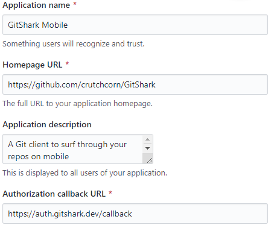

# GitHub OAuth Proxy

[](https://heroku.com/deploy)

A microservice written using ExpressJS in order to enable usage of the GitHub OAuth API without leaking your `client_secret`.

To quote [GitHub's documentation directly](https://developer.github.com/v3/guides/basics-of-authentication/):

> Your client ID and client secret keys come from your application's configuration page. You should never, ever store these values in GitHub--or any other public place, for that matter. We recommend storing them as environment variables--which is exactly what we've done here.

# Usage

In order to deploy this, simply press the "Deploy to Heroku" button up above. You'll need to configure the environmental variables with the description as they're described.

If you want to host using something other than Heroku, you'll need to fill out the environmental variables as well. Simply use [the `app.json`'s 'env' field](./app.json) to help inform what the variables are useful for.

You'll then need to [configure your GitHub OAuth app's settings](https://github.com/settings/developers). You should update your callback URL to match the server route that you've configured followed with `/callback` route: 



## Client-side Usage

Once the server is setup, you have two options for usage. 

1) You can either choose to use `https://your-server-here.com/authorize` in order to redirect to the correct `https://github.com/login/oauth/authorize` route (with filled query params).

2) You can choose to build the URL yourself. You'll need to refer to [the GitHub documentation](https://developer.github.com/apps/building-oauth-apps/authorizing-oauth-apps/) for the query params. Please utilize the `state` field with a UUIDv4.

## Returned Data

Once you've authorized the user, the server will make a call to get the user access token. You'll then be sent the following data via query parameters:

```json
{"access_token":"e72e16c7e42f292c6912e7710c838347ae178b4a", "scope":"repo,gist", "token_type":"bearer"}
```

In a URL like such:

```
gitshark://ghcallback?access_token=e72e16c7e42f292c6912e7710c838347ae178b4a&scope=repo,gist&token_type=bearer
```

# Alternatives

- [`micro-github`](https://github.com/mxstbr/micro-github): Please use this package instead, it will likely be maintained better
- [`github-secret-keeper`](https://github.com/HenrikJoreteg/github-secret-keeper): Please don't use this package instead, as it still exposes the `client_secret` to folks who use your apps
